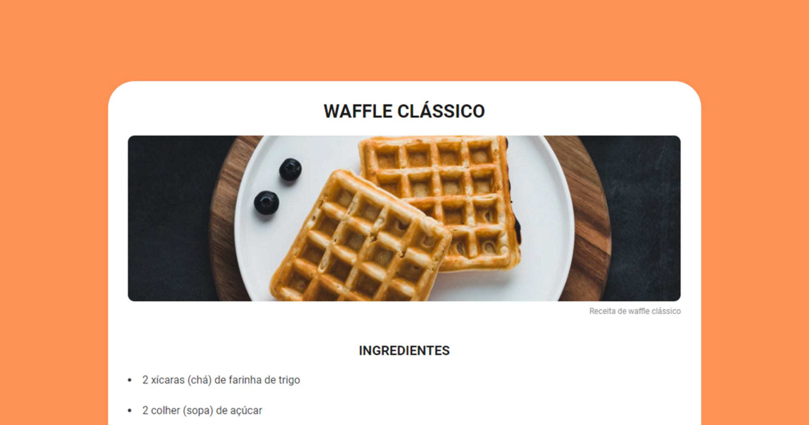

# Página de Receitas

  Nesse desafio você deverá criar uma página web de uma receita com título, imagem, lista de ingredientes e modo de preparo.

  <a href="#-tecnologias">Tecnologias</a>&nbsp;&nbsp;&nbsp;|&nbsp;&nbsp;&nbsp;
  <a href="#-projeto">Projeto</a>&nbsp;&nbsp;&nbsp;|&nbsp;&nbsp;&nbsp;
  <a href="#-layout">Layout</a>&nbsp;&nbsp;&nbsp;|&nbsp;&nbsp;&nbsp;
  <a href="#memo-licença">Licença</a>

  

 

  

## 🚀 Tecnologias

Esse projeto foi desenvolvido com as seguintes tecnologias:

- HTML e CSS
- Git & Github

## 💻 Projeto

Uma página web de uma receita com título, imagem, lista de ingredientes e modo de preparo. Dê uma olhada no projeto [aqui](https://matheusfdosan.github.io/desafio-pagina-receitas-rocketseat/).

## 🔖 Layout

Você pode visualizar o layout do projeto através [DESSE LINK](https://efficient-sloth-d85.notion.site/Desafio-Piloto-P-gina-de-Receita-15acc6a34f744484a2e64a1f115bfbae).

## :memo: Licença

Esse projeto está sob a licença MIT.

---

Feito com ♥ by Rocketseat :wave: [Participe da nossa comunidade!](https://discord.gg/rocketseat)

